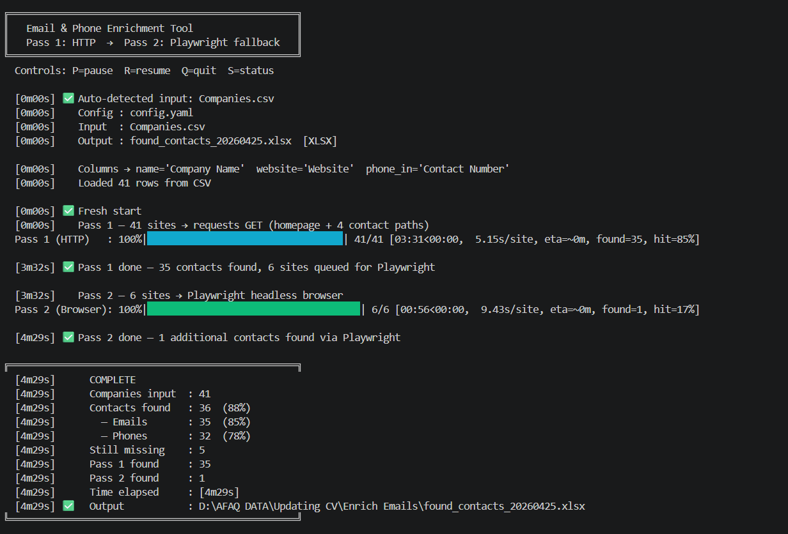
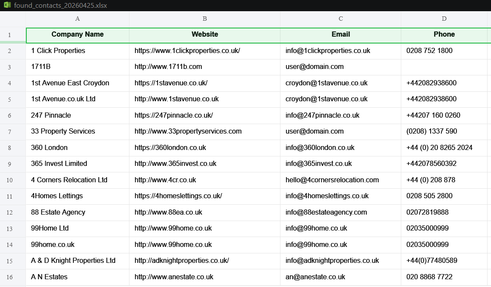

# 📧 Email Enricher

> **Two-pass contact enricher** — scrapes email addresses and phone numbers from company websites using a fast HTTP pass followed by a Playwright headless-browser fallback. Built for high-volume B2B lead generation pipelines.

[](https://github.com/FAAQJAVED/Email-Phone-Number-Enrichment-Tool/actions/workflows/ci.yml)


---

## What it does

* **Ingests any CSV** with a website/URL column — no renaming of files or headers required
* **Pass 1 (HTTP):** fires lightweight `requests` GET calls at the homepage and up to 4 contact sub-pages, extracting plaintext and Cloudflare-obfuscated emails + phone numbers
* **Pass 2 (Browser):** runs headless Chromium via Playwright on every site that Pass 1 missed — handles JavaScript-rendered pages, SPAs, and React/Next.js frontends
* **Outputs** a styled Excel workbook (Results sheet + Run Stats sheet) plus a CSV backup

---

## Key Features

| Feature                           | Detail                                                                                |
| --------------------------------- | ------------------------------------------------------------------------------------- |
| **Dual-pass architecture**  | Fast `requests`first (~80% hit rate), Playwright fallback for the rest              |
| **Cloudflare decoding**     | Decodes `data-cfemail`and `/cdn-cgi/l/email-protection#`XOR-obfuscated emails     |
| **Email quality scoring**   | Personal names score 1 (best), generic addresses 2–3, junk is filtered entirely      |
| **Phone extraction**        | `tel:`href links (highest confidence) → regex fallback for 3 international formats |
| **Cookie banner dismissal** | 10 configurable Playwright selectors, silently ignored on failure                     |
| **Atomic checkpoint**       | Writes to `.tmp`then `os.replace()`— no data loss on crash or kill               |
| **Resume anywhere**         | Re-run the same command to continue; already-processed sites are never re-scraped     |
| **Background auto-save**    | Saves every 60 s (configurable) + every 10 sites in both passes                       |
| **Cross-platform controls** | P / R / Q / S keys (Windows: no Enter; Mac/Linux: type + Enter)                       |
| **Remote command file**     | `echo pause > command.txt`controls a running process without killing it             |
| **winsound beeps**          | Audio feedback for start, pause, resume, done — silently skipped on non-Windows      |
| **Disk space guard**        | Pauses before the output volume fills up during long runs                             |
| **Auto-pause on outage**    | Polls every 30 s and resumes automatically when internet is restored                  |
| **Wall-clock stop time**    | `stop_at: "23:00"`halts the run and saves a resumable checkpoint                    |
| **User-agent rotation**     | Randomised from a configurable pool on every request                                  |
| **XLSX Run Stats sheet**    | Hit rates, per-pass counts, elapsed time — all in Sheet 2 of the output              |
| **tqdm progress bar**       | Live count, hit%, and ETA for both passes (graceful shim if tqdm is absent)           |

---

## Real Results

> Tested against 3,000+ UK property-sector websites (letting agents, block managers, HMO landlords).

* **~80% hit rate on Pass 1** (plain HTTP) — most sites serve contact emails in static HTML
* **Additional ~10–15%** recovered by Pass 2 (Playwright) on JS-heavy property portals
* **Cloudflare-protected sites** decoded correctly — XOR key is extracted and applied per address
* Full run of 1,200 sites completes in **~35–45 minutes** on a standard broadband connection

### Terminal progress



### Excel output



---

## Quick Start

### 1. Clone

```bash
git clone https://github.com/FAAQJAVED/Email-Phone-Number-Enrichment-Tool.git
cd Email-Phone-Number-Enrichment-Tool
```

### 2. Install dependencies

```bash
pip install -r requirements.txt
```

### 3. Install Playwright Chromium

```bash
python -m playwright install chromium
```

### 4. Run

```bash
# Auto-detects your CSV and column names
python enricher.py

# Or specify explicitly
python enricher.py --input leads.csv --output results.xlsx
```

---

## Input Format

Drop **any CSV** with a website/URL column into the project folder. The tool auto-detects headers — no renaming needed.

```csv
Company Name,Website,Category
Acme Lettings,https://acmelettings.co.uk,Letting Agent
City Block Mgmt,https://cityblock.co.uk,Block Manager
Prime HMO Ltd,https://primehmo.com,HMO Landlord
```

**Detected automatically by keyword matching:**

| Field              | Detected by keywords                                                                                        | Required?                        |
| ------------------ | ----------------------------------------------------------------------------------------------------------- | -------------------------------- |
| Website / URL      | `website` `url` `domain` `site` `web` `link` `homepage`                                       | ✅ Yes                           |
| Company Name       | `company` `name` `organisation` `organization` `business` `firm` `client` `brand` `title` | No — falls back to first column |
| Category           | `category` `type` `sector` `industry` `segment` `group` `vertical`                            | No — omitted silently           |
| Pre-existing Phone | `phone` `tel` `mobile` `cell` `number` `contact number`                                         | No — carried through to output  |

Override auto-detection in `config.yaml` under `columns:` if needed.

---

## Output Format

### Excel workbook — `found_contacts_YYYYMMDD.xlsx`

**Sheet 1 — Results**

| Company Name    | Website                    | Email                    | Phone            | Category      |
| --------------- | -------------------------- | ------------------------ | ---------------- | ------------- |
| Acme Lettings   | https://acmelettings.co.uk | james@acmelettings.co.uk | +44 20 7946 0123 | Letting Agent |
| City Block Mgmt | https://cityblock.co.uk    | info@cityblock.co.uk     | (020) 3456 7890  | Block Manager |

**Sheet 2 — Run Stats**

| Metric             | Value               |
| ------------------ | ------------------- |
| Run Timestamp      | 2024-12-01 22:14:03 |
| Input File         | leads.csv           |
| Companies Input    | 1,200               |
| Contacts Found     | 960                 |
| — Emails Found    | 912                 |
| — Phones Found    | 690                 |
| Email Success Rate | 76%                 |
| Phone Success Rate | 57%                 |
| Any Contact Rate   | 80%                 |
| Still Missing      | 240                 |
| Pass 1 Found       | 720                 |
| Pass 2 Found       | 240                 |
| Time Elapsed       | [42m18s]            |

A **CSV backup** is always written alongside the Excel file (used for resume on next run).

---

## Runtime Controls

| Key   | Action                 |
| ----- | ---------------------- |
| `P` | Pause / Resume         |
| `R` | Resume (if paused)     |
| `Q` | Quit and save progress |
| `S` | Print current status   |

> **Windows:** single keypress — no Enter required (uses `msvcrt`).
> **Mac / Linux:** type the letter then press **Enter** (uses `select` + stdin).

**Remote control via file** (works while the script is running in a terminal or scheduled task):

```bash
echo pause   > command.txt   # pause after current site
echo resume  > command.txt   # resume
echo stop    > command.txt   # save and exit
echo fresh   > command.txt   # delete checkpoint (restart on next run)
```

---

## Configuration

Edit `config.yaml` — every option is documented inline. Key settings:

| Key                        | Default                    | Description                                            |
| -------------------------- | -------------------------- | ------------------------------------------------------ |
| `input_file`             | `""`                     | Blank = auto-detect CSV in current directory           |
| `output_file`            | `""`                     | Blank = auto-generate `found_contacts_YYYYMMDD.xlsx` |
| `output_format`          | `"xlsx"`                 | `"xlsx"`or `"csv"`                                 |
| `http_timeout`           | `[4, 6]`                 | `[connect_timeout, read_timeout]`in seconds          |
| `playwright_timeout`     | `8000`                   | Page load timeout in ms (Pass 2)                       |
| `browser_restart_every`  | `150`                    | Restart Chromium every N sites (prevents memory leak)  |
| `stop_at`                | `"23:00"`                | Wall-clock auto-stop time (blank to disable)           |
| `autosave_interval`      | `60`                     | Background save every N seconds                        |
| `rate_limit.min_seconds` | `0.1`                    | Minimum delay between requests                         |
| `rate_limit.max_seconds` | `0.5`                    | Maximum delay between requests                         |
| `contact_paths`          | `["/contact", ...]`      | Sub-pages visited per site                             |
| `skip_email_keywords`    | `[noreply, gdpr, ...]`   | Emails matching these are discarded                    |
| `generic_email_keywords` | `[info, hello, ...]`     | Emails matching these are scored lower                 |
| `junk_email_domains`     | `[sentry.io, ...]`       | Emails from these domains are discarded                |
| `cookie_selectors`       | `[button:has-text(...)]` | Playwright cookie-dismiss selectors                    |

Copy `config.example.yaml` → `config.yaml` to get started.

---

## Project Structure

```
Email-Phone-Number-Enrichment-Tool/
├── enricher.py              ← Orchestrator — two-pass pipeline, CLI, banners
├── core/
│   ├── __init__.py          ← Public re-exports
│   ├── email_utils.py       ← extract_emails, decode_cloudflare, score_email, best_email
│   ├── http_utils.py        ← fetch_url (hard-kill thread timeout), enrich_one_http
│   ├── browser_utils.py     ← launch_browser, dismiss_cookie_banner, enrich_one_browser
│   ├── storage.py           ← Atomic checkpoint, XLSX/CSV output
│   └── controls.py          ← State, ControlListener, AutoSaver, check_cmd_file
├── tests/
│   ├── __init__.py
│   └── test_core.py         ← 50+ unit tests
├── .github/
│   └── workflows/
│       └── ci.yml           ← pytest on push × 3 Python × 2 OS
├── config.yaml              ← Full annotated config
├── config.example.yaml      ← Safe-to-commit placeholder template
├── requirements.txt
├── requirements-dev.txt
├── pyproject.toml
├── CHANGELOG.md
├── LICENSE                  ← MIT
└── README.md
```

---

## Running Tests

```bash
pip install -r requirements-dev.txt
pytest -v
```

With coverage:

```bash
pytest --cov=core --cov=enricher --cov-report=term-missing
```

---

## Part of the B2B Lead Toolkit

This enricher is one component of a broader B2B lead generation pipeline targeting UK property management companies, letting agents, block managers, and HMO landlords.

| Repo                                                                                                                           | What it does                                                |
| ------------------------------------------------------------------------------------------------------------------------------ | ----------------------------------------------------------- |
| **[Email-Phone-Number-Enrichment-Tool](https://github.com/FAAQJAVED/Email-Phone-Number-Enrichment-Tool)**←*you are here* | Scrapes contact emails + phones from company websites       |
| **[Google Maps Business Scraper](https://github.com/FAAQJAVED/Google-Maps-Business-Scraper)**                               | Extracts and enriches business listings from Google Maps    |
| **[Leadhunter Pro](https://github.com/FAAQJAVED/Leadhunter_Pro)**                                                           | Multi-engine search scraper with HOT/WARM/COLD lead scoring |
| **[Trustpilot Business Scraper](https://github.com/FAAQJAVED/trustpilot-business-scraper)**                                 | Extracts business listings from Trustpilot search results   |

---

## Tech Stack


| Library        | Role                                                                   |
| -------------- | ---------------------------------------------------------------------- |
| `requests`   | Pass 1 — fast, lightweight HTTP GET with threading-based hard timeout |
| `playwright` | Pass 2 — headless Chromium for JavaScript-rendered pages              |
| `openpyxl`   | Excel output with styled headers and Run Stats sheet                   |
| `pyyaml`     | YAML config loading with default fallback                              |
| `tqdm`       | Live terminal progress bar with ETA for both passes                    |
| `urllib3`    | SSL warning suppression for sites with invalid certificates            |

---

## Notes

* `robots.txt` is **not** enforced automatically — ensure your use case complies with each site's terms of service and applicable law.
* SSL certificate errors are suppressed to handle sites with expired or self-signed certificates.
* No data is stored or transmitted externally — all output is written locally.
* The `sync_playwright().__enter__()` pattern is used instead of `with sync_playwright() as p:` to avoid a Windows + Python 3.12 ContextVar incompatibility.

---

## License

MIT © 2026 [FAAQJAVED](https://github.com/FAAQJAVED)
